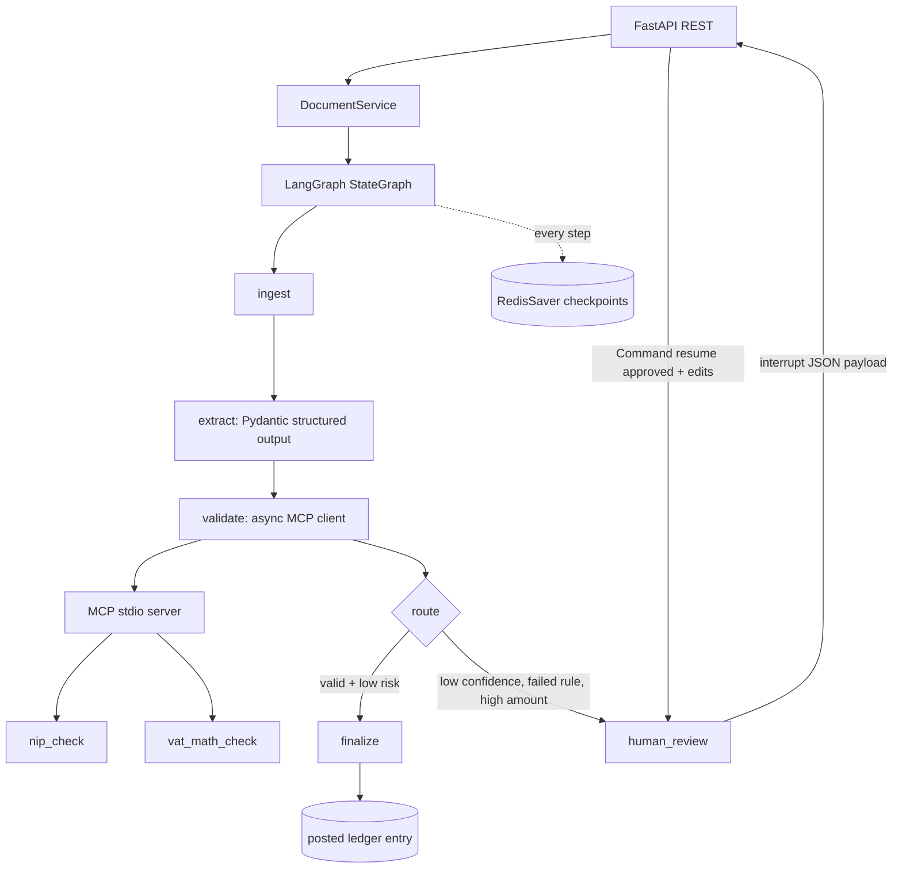

# tax-doc-review-agent

**English** | [Polski](README.pl.md)

Production-style reference agent for ingesting expense documents, validating Polish tax fields, pausing for human approval, and posting approved invoices to a ledger.

## What this demonstrates

- LangGraph `StateGraph` with typed state and dynamic `interrupt()` HITL.
- Redis-backed `RedisSaver` checkpoints, including resume after graph object/process restart.
- MCP v2 stdio server with deterministic `nip_check` and `vat_math_check` tools.
- FastAPI REST API with bearer authentication and correct 4xx responses.
- Pydantic structured extraction contract and deterministic validation rules.
- Hermetic `pytest-asyncio` tests using `FakeLLM`; optional Claude structured output for demos.
- Docker Compose Redis 8, Dockerfile, Makefile, Ruff, mypy, and GitHub Actions.

## Architecture



## Quickstart

Requirements: Python 3.12, uv, Docker Desktop.

```bash
cp .env.example .env
docker compose up -d redis
uv sync
uv run pytest -q
uv run uvicorn app.main:app --reload
```

Docker runs API and Redis together:

```bash
docker compose up --build
```

Default bearer token is `dev-token`. Change `API_BEARER_TOKEN` before exposing the service.

## REST HITL session

Low confidence forces review:

```bash
curl -X POST http://localhost:8000/documents \
  -H 'Authorization: Bearer dev-token' -H 'Content-Type: application/json' \
  -d '{"content":{"vendor":"Acme Supplies","nip":"5260250995","amount_net":"2000.00","vat_rate":"23","amount_gross":"2460.00","date":"2025-06-15","category":"office","confidence":0.42}}'
```

Response contains `thread_id`, `status: needs_review`, and JSON `interrupt` payload. Inspect it later:

```bash
curl http://localhost:8000/documents/<thread_id> -H 'Authorization: Bearer dev-token'
curl -X POST http://localhost:8000/documents/<thread_id>/review \
  -H 'Authorization: Bearer dev-token' -H 'Content-Type: application/json' \
  -d '{"approved":true,"edits":{"category":"professional_services"}}'
```

Approved response has `status: posted` and deterministic `ledger_entry.entry_id`.

## LLM modes

Tests always inject `FakeLLM`, which parses JSON/labeled text deterministically and makes CI hermetic. Without `ANTHROPIC_API_KEY`, the API also uses `FakeLLM`. Set `ANTHROPIC_API_KEY` and optional `ANTHROPIC_MODEL` to use `ChatAnthropic.with_structured_output(InvoiceFields)` in a demo.

## Why these choices

### Redis checkpointer vs memory

`InMemorySaver` is useful for isolated unit tests but loses pending approvals on process exit. `RedisSaver` stores checkpoints by `thread_id`, so a different graph object can resume the same document after restart. Redis 8 includes modules required by the current checkpoint package.

### `interrupt()` vs `interrupt_before`

This flow uses dynamic `interrupt()` because review is conditional: only low confidence, failed rules, or high amounts need a decision. Static `interrupt_before` would pause every matching graph execution and would not carry a data-specific JSON review payload as directly.

### Idempotency

LangGraph re-executes code before `interrupt()` when resumed. Nodes before the pause only normalize, extract, and validate; those operations have no external side effects. Finalization uses deterministic `ledger-{thread_id}` identity, making a retried final step safe to reconcile.

## Checks

```bash
make test       # >=15 tests; Redis-backed tests skip cleanly if Redis is unavailable
make lint
make typecheck
```

