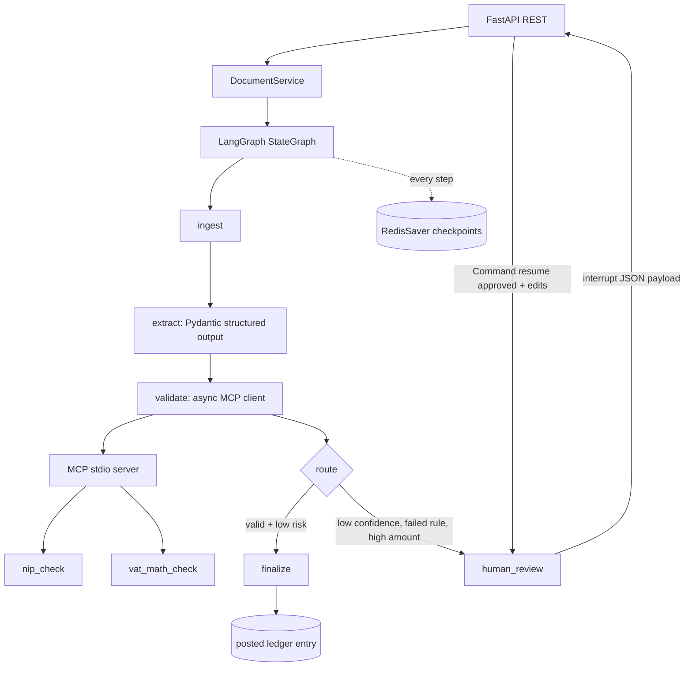

# tax-doc-review-agent

[English](README.md) | **Polski**

Referencyjny agent w stylu produkcyjnym: przyjmuje dokumenty kosztowe, waliduje polskie pola podatkowe, wstrzymuje przepływ na akceptację człowieka i księguje zatwierdzone faktury w rejestrze.

## Co to pokazuje

- LangGraph `StateGraph` z typowanym stanem i dynamicznym `interrupt()` w trybie HITL (human-in-the-loop).
- Checkpointy `RedisSaver` oparte o Redis, wraz ze wznowieniem po restarcie obiektu grafu lub procesu.
- Serwer MCP v2 po stdio z deterministycznymi narzędziami `nip_check` i `vat_math_check`.
- REST API na FastAPI z uwierzytelnianiem bearer i poprawnymi odpowiedziami 4xx.
- Kontrakt ustrukturyzowanej ekstrakcji w Pydantic oraz deterministyczne reguły walidacji.
- Hermetyczne testy `pytest-asyncio` z użyciem `FakeLLM`; opcjonalnie structured output z Claude do demo.
- Docker Compose z Redis 8, Dockerfile, Makefile, Ruff, mypy i GitHub Actions.

## Architektura



## Szybki start

Wymagania: Python 3.12, uv, Docker Desktop.

```bash
cp .env.example .env
docker compose up -d redis
uv sync
uv run pytest -q
uv run uvicorn app.main:app --reload
```

Docker uruchamia API i Redis razem:

```bash
docker compose up --build
```

Domyślny token bearer to `dev-token`. Zmień `API_BEARER_TOKEN`, zanim wystawisz usługę na zewnątrz.

## Sesja HITL przez REST

Niska pewność wymusza przegląd:

```bash
curl -X POST http://localhost:8000/documents \
  -H 'Authorization: Bearer dev-token' -H 'Content-Type: application/json' \
  -d '{"content":{"vendor":"Acme Supplies","nip":"5260250995","amount_net":"2000.00","vat_rate":"23","amount_gross":"2460.00","date":"2025-06-15","category":"office","confidence":0.42}}'
```

Odpowiedź zawiera `thread_id`, `status: needs_review` oraz payload `interrupt` w JSON. Możesz go sprawdzić później:

```bash
curl http://localhost:8000/documents/<thread_id> -H 'Authorization: Bearer dev-token'
curl -X POST http://localhost:8000/documents/<thread_id>/review \
  -H 'Authorization: Bearer dev-token' -H 'Content-Type: application/json' \
  -d '{"approved":true,"edits":{"category":"professional_services"}}'
```

Zatwierdzona odpowiedź ma `status: posted` i deterministyczne `ledger_entry.entry_id`.

## Tryby LLM

Testy zawsze wstrzykują `FakeLLM`, który deterministycznie parsuje JSON/tekst z etykietami i czyni CI hermetycznym. Bez `ANTHROPIC_API_KEY` API również korzysta z `FakeLLM`. Ustaw `ANTHROPIC_API_KEY` oraz opcjonalnie `ANTHROPIC_MODEL`, aby w demo użyć `ChatAnthropic.with_structured_output(InvoiceFields)`.

## Dlaczego takie wybory

### Checkpointer w Redis zamiast pamięci

`InMemorySaver` sprawdza się w izolowanych testach jednostkowych, ale traci oczekujące akceptacje przy zakończeniu procesu. `RedisSaver` przechowuje checkpointy według `thread_id`, więc inny obiekt grafu może wznowić ten sam dokument po restarcie. Redis 8 zawiera moduły wymagane przez aktualny pakiet checkpointów.

### `interrupt()` zamiast `interrupt_before`

Ten przepływ używa dynamicznego `interrupt()`, ponieważ przegląd jest warunkowy: decyzji wymagają tylko niska pewność, niespełniona reguła lub wysoka kwota. Statyczne `interrupt_before` wstrzymywałoby każde pasujące wykonanie grafu i nie przenosiłoby tak bezpośrednio payloadu przeglądu w JSON zależnego od danych.

### Idempotentność

LangGraph ponownie wykonuje kod sprzed `interrupt()` przy wznowieniu. Węzły przed pauzą jedynie normalizują, ekstrahują i walidują; te operacje nie mają zewnętrznych efektów ubocznych. Finalizacja używa deterministycznej tożsamości `ledger-{thread_id}`, dzięki czemu ponowione wykonanie ostatniego kroku jest bezpieczne do uzgodnienia.

## Weryfikacja

```bash
make test       # >=15 testów; testy oparte o Redis są pomijane, gdy Redis jest niedostępny
make lint
make typecheck
```
